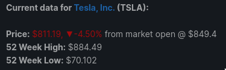

a simple maubot module that responds with financial data about stock price or cryptocurrency exchange rate.

note: this module depends on having an api key for the following services
[RapidAPI](https://rapidapi.com/marketplace) (used for the yahoo-finance api endpoints, which you must subscribe to in your account settings)
[CoinAPI](https://www.coinapi.io/Pricing)

## Setup
plug in API keys for both your RapidAPI yahoo finance app and your CoinAPI account in the config file (either before packaging in the base-config, or directly in the maubot interface after loading).

update the commands you want to use, by default stock data is returned with the `!stonks` command, and crypto data is returned with `!hodl` command. for example:

`!stonks tsla`

would return something like this:

and

`!hodl btc/ada`

would return something like this:

